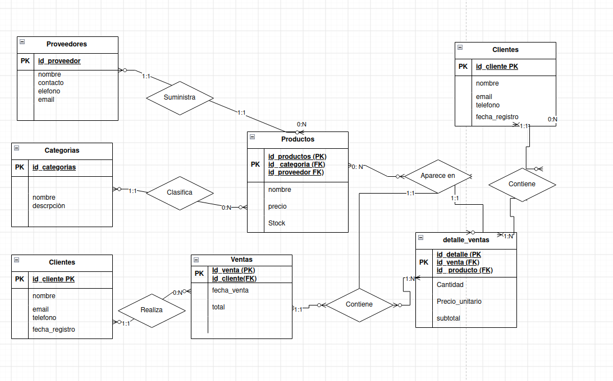
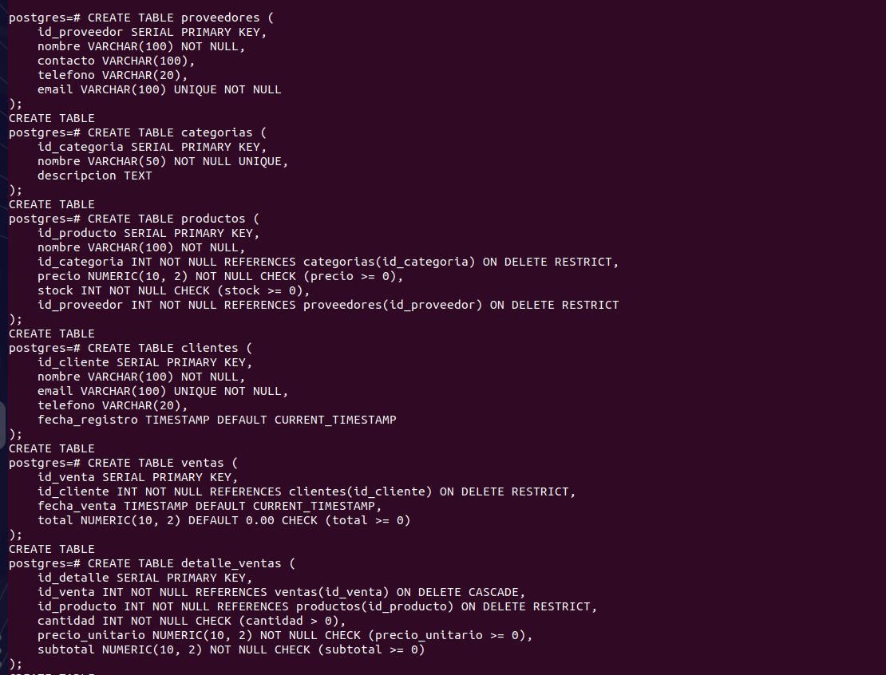
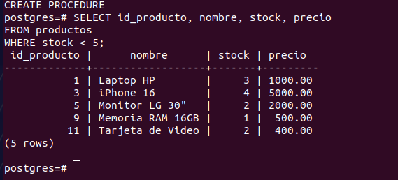
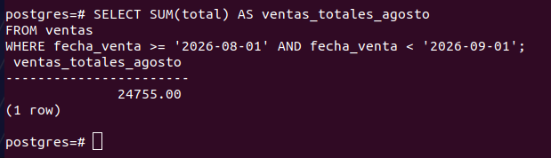
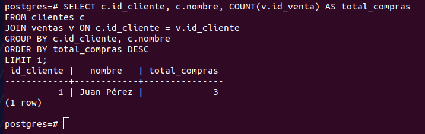
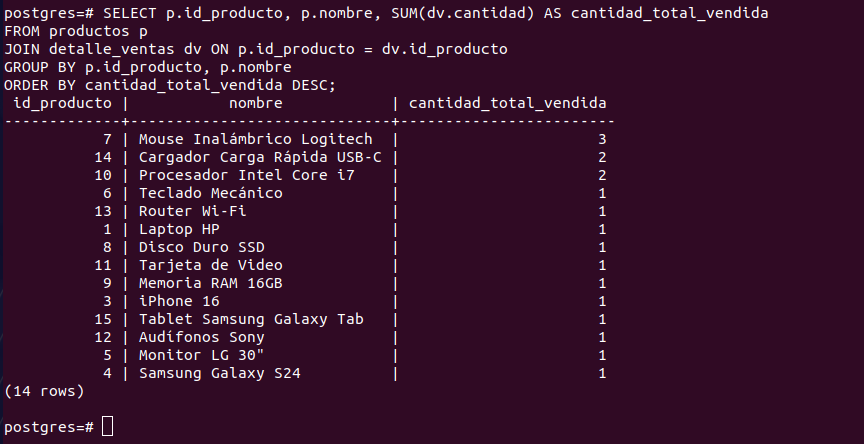
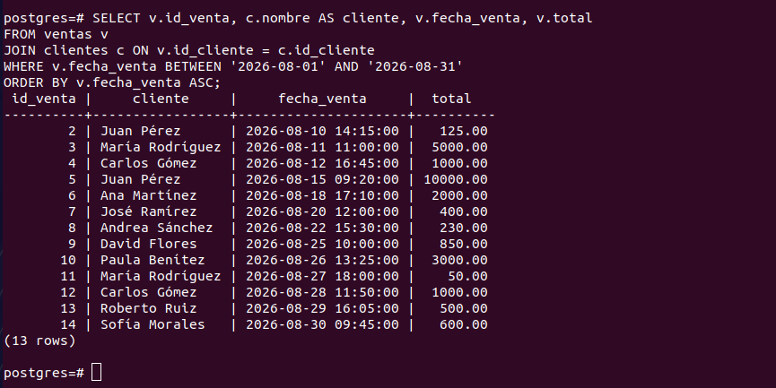
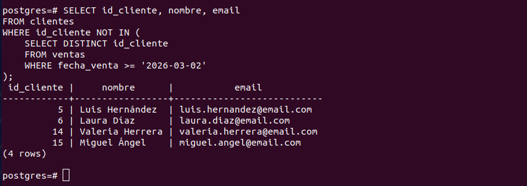

# gestiòn_de_Inventario_examen
# TechZone - Sistema de Gestión de Inventario y Ventas

## Descripción del Proyecto
TechZone es una solución integral para el control de inventario, proveedores y registros de ventas en PostgreSQL. Permite automatizar la deducción de inventario, validar existencias en tiempo real y consultar reportes analíticos de rendimiento comercial.

## Modelo Entidad-Relación

## Creaciòn de Tablas

# Evidencias de Consultas SQL (queries.sql)
1️⃣ Listar los productos con stock menor a 5 unidades.

2️⃣ Calcular ventas totales de un mes específico.

3️⃣ Obtener el cliente con más compras realizadas.

4️⃣ Listar los productos más vendidos.

5️⃣ Consultar ventas realizadas en un rango de fechas.

6️⃣ Identificar clientes que no han comprado en los últimos 6 meses.

